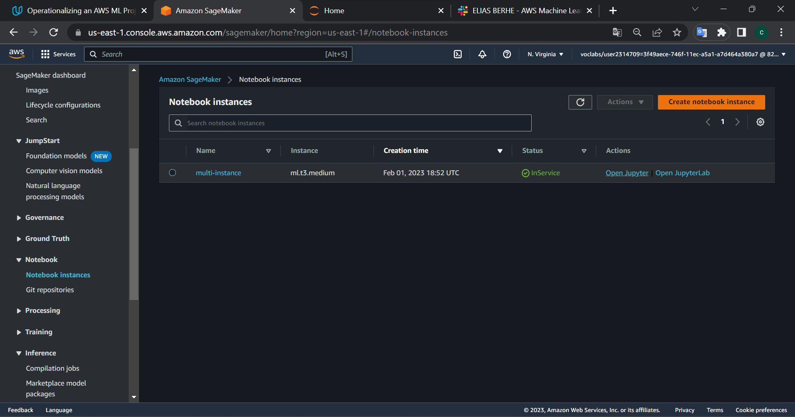
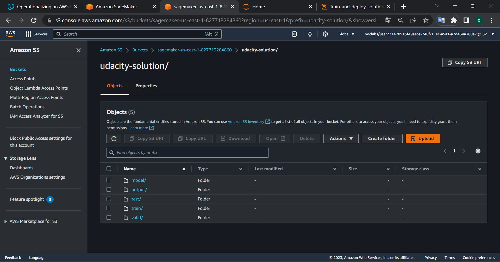
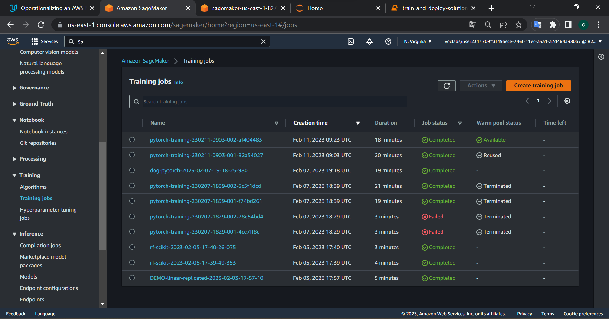
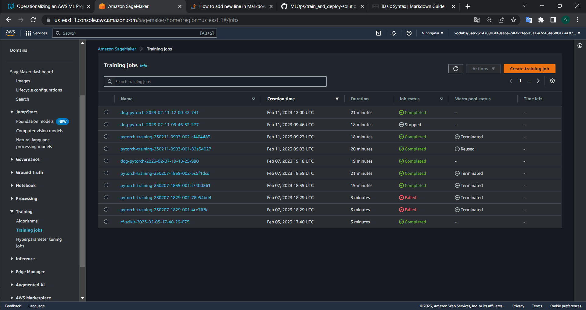
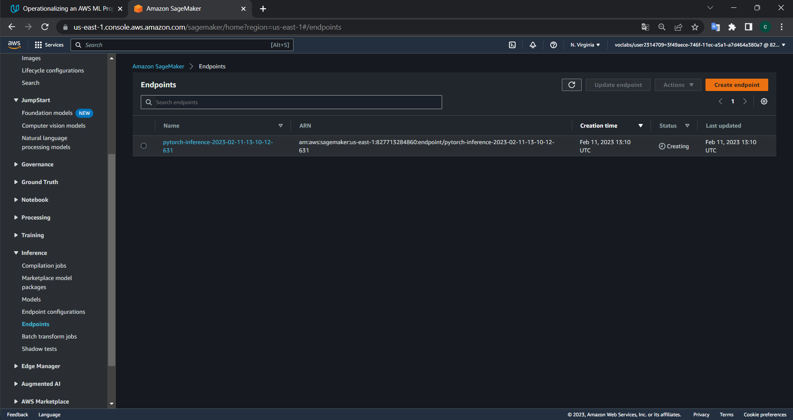
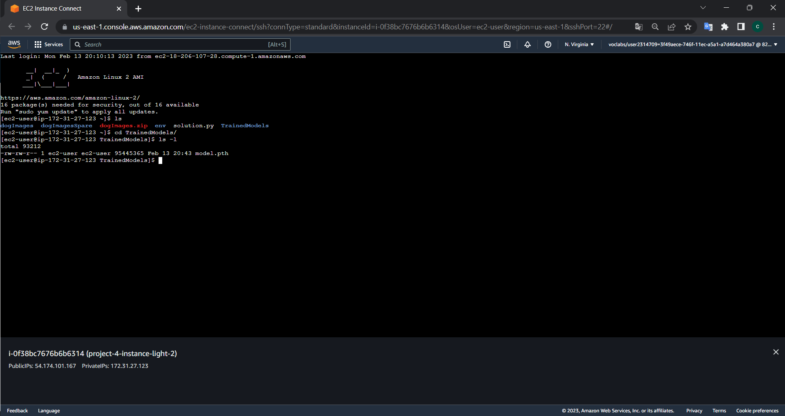
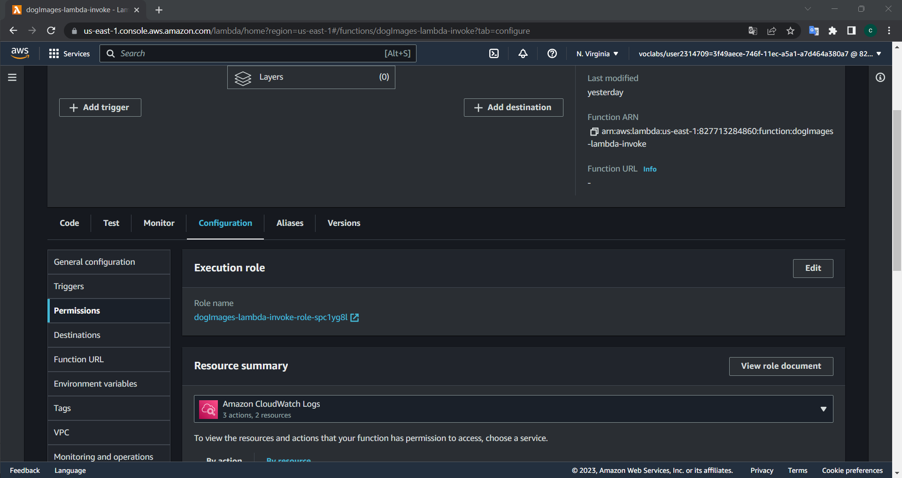
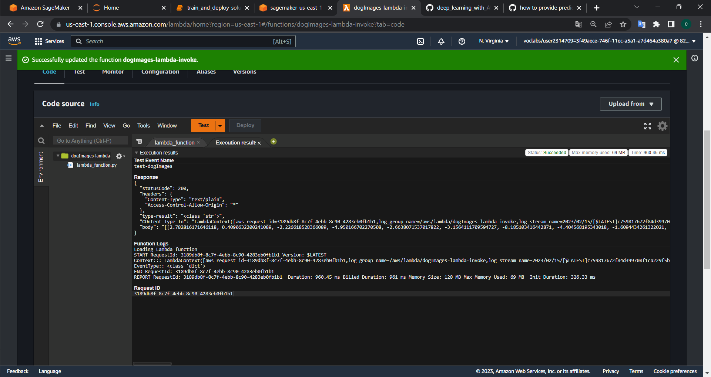
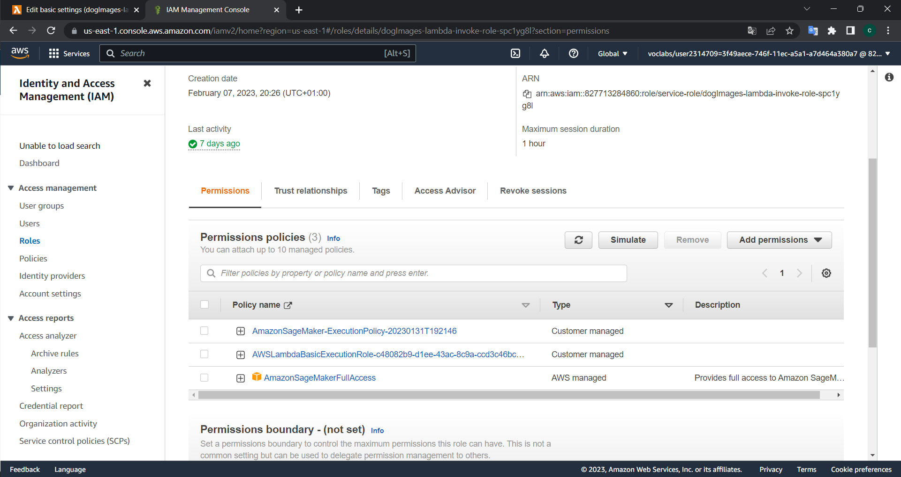
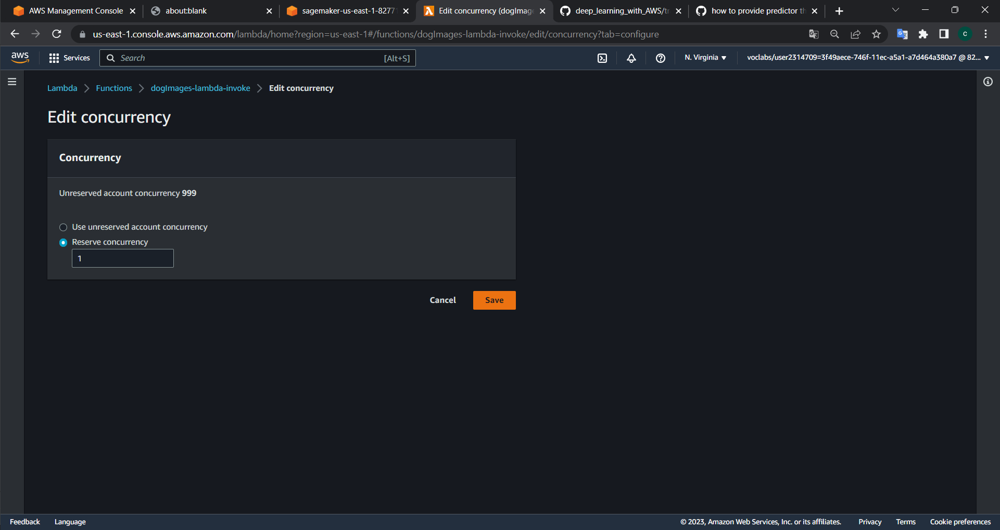

# STEP 1: TRAINING AND DEPLOYMENT ON SAGAMAKER 
<strong>a. INITIAL SETUP</strong> 
In this step I created the notebook instance. I chose ml.t3.medium because I thought it is a good tradeoff between speed and cost. 
Then I uploaded training_and_deploy-solution.ipynb and hpo.py files into notebook instance
> Sagemaker Dashboard screenshot: 

<strong>b. DOWNLOAD DATA TO AN S3 BUCKET</strong> 
The first step of training_and_deploy-solution.ipynb is related to the loading of dataset to S3 bucket.
> S3 dashboard with training, validation and testing data uploaded: 

<strong>c. TRAINING AND DEPLOYMENT</strong> 
I started hyperparameter training using tuner object by Sagemaker.
Then, I get the best HP of estimator and started the training. 
The trained model name is: 
>s3://sagemaker-us-east-1-827713284860/dog-pytorch-2023-02-11-12-00-42-741/output/model.tar.gz

> HPO tuner after complete: 

> Training job after complete: 

Then, I started the deployment of the above-mentioned model. 
The name of deployed model is: pytorch-inference-2023-02-11-13-10-12-631

> Model Deploy (In Progress): 

> Model Deploy (Completed): 

<strong>d. MULTI-INSTANCE TRAINING</strong> 

Link: 
* https://sagemaker.readthedocs.io/en/stable/api/training/smd_model_parallel_general.html
* https://docs.aws.amazon.com/sagemaker/latest/dg/distributed-training.html
* https://github.com/aws/amazon-sagemaker-examples/blob/main/training/distributed_training/pytorch/data_parallel/mnist/pytorch_smdataparallel_mnist_demo.ipynb
* https://sagemaker.readthedocs.io/en/stable/frameworks/pytorch/sagemaker.pytorch.html

I changed the estimator definition with the following 2 changes:
1. instance_count = 2 instead if instance_count = 1
2. added the parameter: distribution={"smdistributed": {"dataparallel": {"enabled": True}}}

# STEP 2: EC2 TRAINING

<strong>a. EC2 SETUP</strong> 
I choose no AMI but used Amazon instance ml.t3.large. At first glance I tried with a ml.t2.micro instance but it seems too slow to train.
So I chose a ml.t3.large since I though it is the best tradeoff between cost and performance.
Then I create a virtual environment with the following commands:
> * python3 -m venv env
> * source env/bin/source
> * pip install .....all dependencies (e.g. torch, numpy, tqdm, pandas)

Then, I trained the model and saved it into TrainedModels folder: 

I also analyzed the code in the file ec2train.py and following I wrote up the differences:
1. No arguments are passed through argparse python library; that's why I launched the script directly and not from PyTorch estimator.
2. The function create_data_loaders works with already downloaded image folders, while the hpo.py leverage the data from S3 bucket downloaded from container.
3. I can conclude that the changes are minimal to adapt hpo.py to EC2 training.

# STEP 3: LAMBDA FUNCTION
<strong>a. SETTING UP A LAMBDA FUNCTION</strong> 
I analyzed the content of the lambda function code. I can see the following main section:
1. boto3.Session().client() object that is used to invoke the endpoint with the method invoke_endpoint().
2. The method invoke_endpoint needs to pass (beyond other stuffs) the Body content. It is retrieved by the event variable.
3. The event variable contains a json with key = 'url' and value = '<S3 link of the image to do inference>'
4. The invoke_endpoint method returns the result of inference; it's a JSON file, so I need to extract the value of Body key and then decode it from utf-8
5. Finally, the lambda function return a JSON object with the following key:value pairs:
   * statusCode: 200, to show correct execution
   * headers: the type of content
   * type-result: the result of inference
   * Content-Type-In: the context previous passed to the lambda
   * body: the result of inference dumped into a JSON object

# STEP 4: SECUTIRY
<strong>a. LAMBDA FUNCTION SECURITY SETTING</strong> 
To setting up the role for my lambda I followed this steps:
* From my lambda panel selected: Configuration-->Permission and show the section Execution role
* Clicked on Edit button and selected "View the .... on the IAM console"
* Finally, I attached the role: AmazonSageMakerFullAccess

<strong>b. LAMBDA FUNCTION TESTING</strong> 
To make a test with my lambda and my endpoint I followed the steps:
* Restart the endpoint from S3 bucket artifact link within Jupyter Notebook:
> pytorch_model = PyTorchModel(model_data=model_location, role=get_execution_role(), entry_point='inference2.py',py_version='py3',
                             framework_version='1.4',
                             predictor_cls=ImagePredictor)

> predictor = pytorch_model.deploy(initial_instance_count=1, instance_type='ml.m5.large')

* Click on Test button from Lambda console. I get the following result:

> Test Event Name 
test-dogImages 
Response 
{ 
  "statusCode": 200, 
  "headers": { 
    "Content-Type": "text/plain", 
    "Access-Control-Allow-Origin": "*" 
  }, 
  "type-result": "<class 'str'>", 
  "COntent-Type-In": "LambdaContext([aws_request_id=3189db8f-8c7f-4ebb-8c90-4283eb0fb1b1,log_group_name=/aws/lambda/dogImages-lambda-invoke,log_stream_name=2023/02/15/[$LATEST]c759817672f84d399708f1ca229f5bc5,function_name=dogImages-lambda-invoke,memory_limit_in_mb=128,function_version=$LATEST,invoked_function_arn=arn:aws:lambda:us-east-1:827713284860:function:dogImages-lambda-invoke,client_context=None,identity=CognitoIdentity([cognito_identity_id=None,cognito_identity_pool_id=None])])",
  "body": "[[2.782816171646118, 0.4090632200241089, -2.226618528366089, -4.950166702270508, -2.6638071537017822, -3.1564111709594727, -8.185103416442871, -4.404568195343018, -1.6094434261322021, -7.599176406860352, -4.499636173248291, -4.872038841247559, -1.584049940109253, -5.789053440093994, -7.698945045471191, -7.2643890380859375, 1.0508008003234863, -5.322773456573486, -4.336639881134033, -5.117930889129639, -2.7038588523864746, -6.5882039070129395, -7.2359724044799805, -1.0405062437057495, -4.664735794067383, -0.284102201461792, -5.473607063293457, -5.963810443878174, -1.6414381265640259, -1.5736708641052246, -3.6830291748046875, -5.707861423492432, 0.9521876573562622, -3.90817928314209, -1.8502814769744873, 0.7728018164634705, -3.3942229747772217, 2.024136543273926, -2.901603937149048, -2.0404345989227295, -3.845057249069214, 0.6575574278831482, -4.427330493927002, -3.5859501361846924, -5.915630340576172, 0.3757569193840027, -4.963106155395508, -2.736490488052368, 0.31342071294784546, -2.97778582572937, -4.367672920227051, -2.36167573928833, 0.5195390582084656, -5.586461544036865, -4.618607521057129, -2.557987689971924, -5.387967109680176, 0.686273455619812, -4.851746082305908, -4.640315055847168, -1.8063074350357056, -1.9529699087142944, -2.5824944972991943, 2.1093525886535645, -5.842164993286133, -3.167668104171753, -4.742136001586914, -2.4567067623138428, -3.6589343547821045, -5.519630432128906, -7.0190815925598145, -5.545979976654053, -0.7041696310043335, -0.1396695226430893, 1.4311996698379517, -2.4678778648376465, -1.3209835290908813, -4.991437911987305, -4.027393341064453, -8.490549087524414, -3.4522721767425537, 0.5650013089179993, -5.177587509155273, -4.5093913078308105, -3.012864828109741, -1.5042706727981567, -0.9467733502388, -2.7489898204803467, -3.0729331970214844, -5.759615898132324, -0.8621065020561218, -3.7972564697265625, 0.04425468668341637, -2.805105686187744, -3.8084394931793213, -3.4827446937561035, -1.2593927383422852, -4.727966785430908, -0.28348082304000854, 0.45861586928367615, 1.8857842683792114, -5.2315144538879395, -5.235050678253174, -0.581696093082428, -2.725492000579834, -0.8640506863594055, 0.8640583157539368, -6.417549133300781, -5.586428642272949, -5.340749740600586, -1.1840565204620361, -3.631807804107666, 0.3982338011264801, -1.8069933652877808, -1.7202143669128418, -6.048234462738037, -0.730103611946106, -5.568500995635986, -2.6811718940734863, -6.9274516105651855, -4.195965766906738, -4.593466758728027, -2.8500711917877197, -0.5626233220100403, 0.9106947779655457, -2.985091209411621, 0.9266287684440613, -6.935042858123779, -3.486572504043579, -3.820913076400757, 0.5350926518440247, -3.955044746398926, -0.2989625930786133]]"
} 
Function Logs 
Loading Lambda function 
START RequestId: 3189db8f-8c7f-4ebb-8c90-4283eb0fb1b1 Version: $LATEST 
Context::: LambdaContext([aws_request_id=3189db8f-8c7f-4ebb-8c90-4283eb0fb1b1,log_group_name=/aws/lambda/dogImages-lambda-invoke,log_stream_name=2023/02/15/[$LATEST]c759817672f84d399708f1ca229f5bc5,function_name=dogImages-lambda-invoke,memory_limit_in_mb=128,function_version=$LATEST,invoked_function_arn=arn:aws:lambda:us-east-1:827713284860:function:dogImages-lambda-invoke,client_context=None,identity=CognitoIdentity([cognito_identity_id=None,cognito_identity_pool_id=None])]) 
EventType:: <class 'dict'> 
END RequestId: 3189db8f-8c7f-4ebb-8c90-4283eb0fb1b1 
REPORT RequestId: 3189db8f-8c7f-4ebb-8c90-4283eb0fb1b1	Duration: 960.45 ms	Billed Duration: 961 ms	Memory Size: 128 MB	Max Memory Used: 69 MB	Init Duration: 326.33 ms 

Request ID
3189db8f-8c7f-4ebb-8c90-4283eb0fb1b1

<strong>c. OTHER SECURITY CONSIDERATION</strong> 
According my IAM console, there are 3 policies attached to the Lambda Role:
* AmazonSageMaker-ExecutionPolicy-20230131T192146
* AWSLambdaBasicExecutionRole-c48082b9-d1ee-43ac-8c9a-ccd3c46bce53
* AmazonSageMakerFullAccess

# STEP 5: CONCURRENCY AND AUTOSCALING
<strong>a. CONCURRENCY</strong> 
There are 2 types of concurrency I could set up:
* reserved, in this case I know in advance the maximum number of parallel requirements to the lambda
* provisioned, in this case I don't know in advance this information

I use the former because I suppose to know in advance that the maximum endpoint number should be 2

<strong>b. AUTO-SCALING</strong> 
To configure the endpoint auto-scaling features, I set up the following features:
* max instance count
* scale-in cool down time period (30 seconds)
* scale-out cool down time period (30 seconds)

